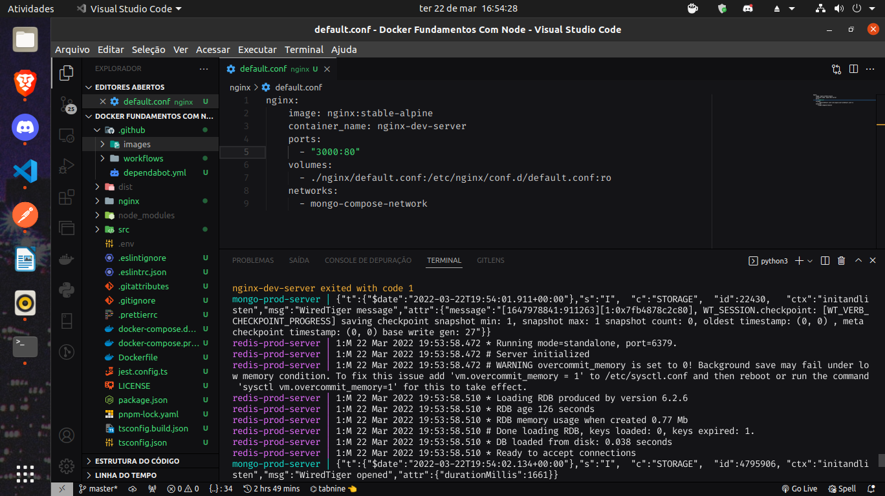

<h1 align="center">
    Só meu teste com Arquivos Docker
</h1>

<h2 align="center">
    E sim, com o mesmo repositório do Express With Datagog
</h2>

<p align="center">
  <a href="#rocket-tecnologias">Tecnologias</a>&nbsp;&nbsp;&nbsp;|&nbsp;&nbsp;&nbsp;
  <a href="#-projeto">Projeto</a>&nbsp;&nbsp;&nbsp;|&nbsp;&nbsp;&nbsp;
  <a href="#-rodando">Rodando</a>&nbsp;&nbsp;&nbsp;|&nbsp;&nbsp;&nbsp;
  <a href="#-como-contribuir">Como contribuir</a>&nbsp;&nbsp;&nbsp;|&nbsp;&nbsp;&nbsp;
</p>

<a id="rocket-tecnologias"></a>

## 🚀 Tecnologias

<div align="center">
 	
     
     
     
     

</div>

<br>

<p align="center">
  
</p>
<a id="-projeto"></a>

## 💻 Projeto

Eu só tava querendo fazer um testes com arquivo Docker, tipo fazer um compose para produção e outro totalmente focado para o desenvolvimento. Então não tem muita coisa se você já viu alguns dos meus Repos.

<a id="-layout"></a>

<a id="-rodando"></a>

## Rodando o projeto 🌇

## Requerimentos:

- [NodeJS](https://nodejs.org/en/)
- [Docker](https://www.docker.com/)

## 📂 Instalando as dependências:

Yarn:

```bash
yarn install
```

NPM:

```bash
npm install
```

### 🐬 Com Docker:

Tudo num simples comando;

```bash
docker-compose --file docker-compose.dev.yml up
```

<a id="-como-contribuir"></a>

## 🤔 Como contribuir

- Faça um fork desse repositório;
- Cria uma branch com a sua feature: `git checkout -b minha-feature`;
- Faça commit das suas alterações: `git commit -m 'feat: Minha nova feature'`;
- Faça push para a sua branch: `git push origin minha-feature`.

Depois que o merge da sua pull request for feito, você pode deletar a sua branch.
